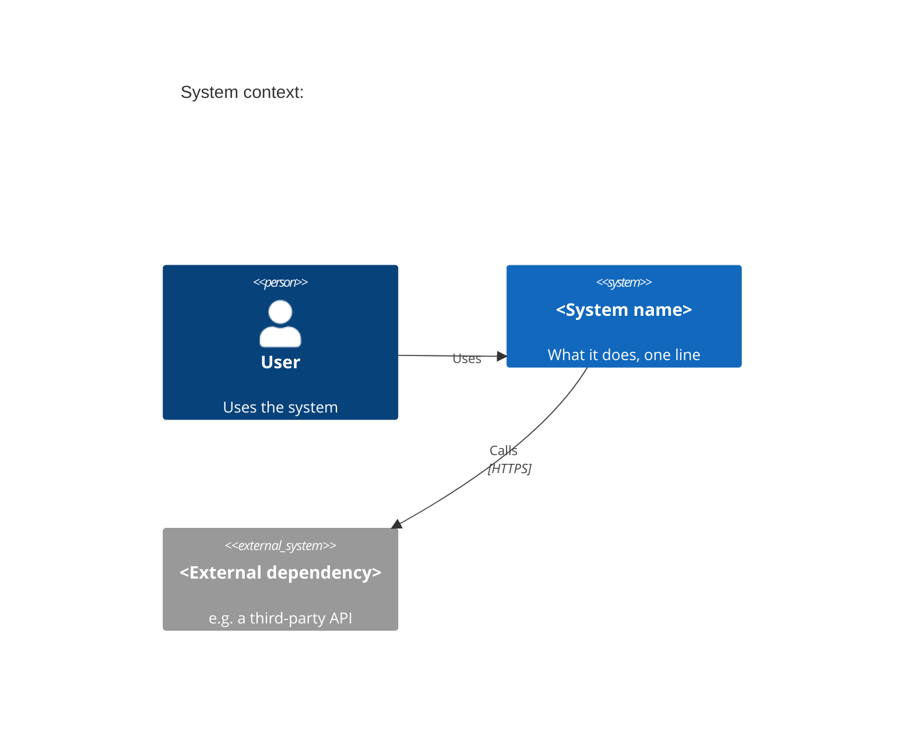
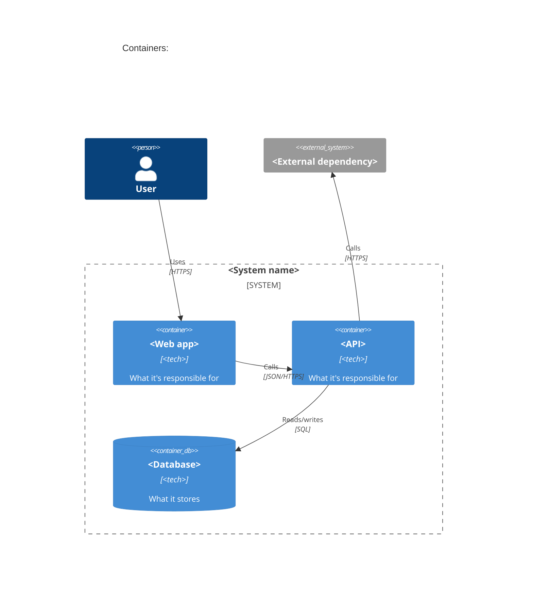
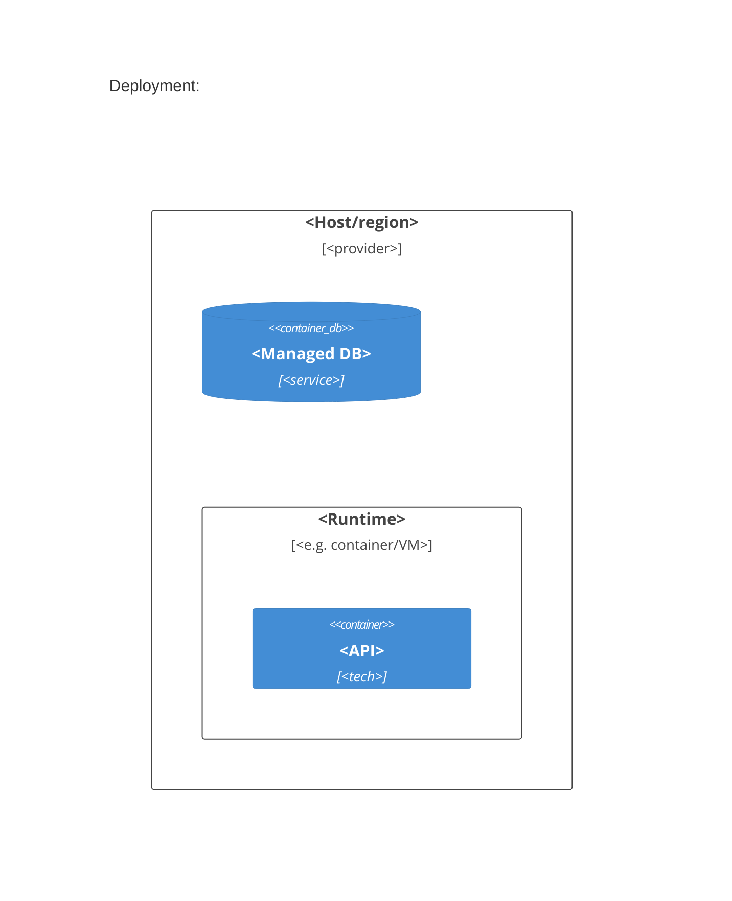

# Mermaid C4 diagrams

Mermaid renders C4-style diagrams natively (`C4Context`, `C4Container`, `C4Component`, `C4Dynamic`, `C4Deployment`). Use these, not a generic flowchart, so the diagram type signals its C4 level to the reader. Confirmed against [mermaid-js/mermaid's own C4 syntax docs](https://github.com/mermaid-js/mermaid/blob/develop/docs/syntax/c4.md).

## Element macros

| Macro | Meaning |
|---|---|
| `Person(alias, "label", "description")` / `Person_Ext(...)` | A human actor; `_Ext` = outside the team's control |
| `System(alias, "label", "description")` / `System_Ext(...)` | A whole system, at Context level |
| `SystemDb(...)` / `SystemQueue(...)` | A system that's fundamentally a database or a queue |
| `Container(alias, "label", "technology", "description")` / `ContainerDb(...)` | A deployable/runnable unit, at Container level |
| `Component(alias, "label", "technology", "description")` | An internal piece of one container, at Component level |
| `Rel(from, to, "label", "technology")` / `BiRel(...)` / `Rel_Back(...)` | A relationship, optionally labeled with the protocol/format |
| `System_Boundary(alias, "label") { ... }` / `Container_Boundary(...)` / `Enterprise_Boundary(...)` | Groups elements visually |
| `Deployment_Node(alias, "label", "description") { ... }` | An infra node (host, VM, browser); nest containers inside it |

Every macro's first arg is a unique alias (used in `Rel`), the rest are display text.

## System Context — always, even for a single script

For a trivial system, skip the diagram and write the one sentence instead: "Talks to X via Y."

## Container — once there's more than one deployable unit

## Deployment — only once hosting is more than "runs locally" or one managed service

## Rules of thumb

- One diagram per level actually in use; don't draw a Container diagram for a one-container system.
- Label every `Rel` with the protocol/format when it isn't obvious ("HTTPS", "gRPC", "SQL"); skip the label when it's just "calls."
- Keep descriptions to one clause. The prose next to the diagram carries the rest.
- `C4Component` and `C4Dynamic` exist but are optional per the source template (Component: "only if it adds value"; Dynamic: only for a scenario worth validating step by step) — don't add them by default.
