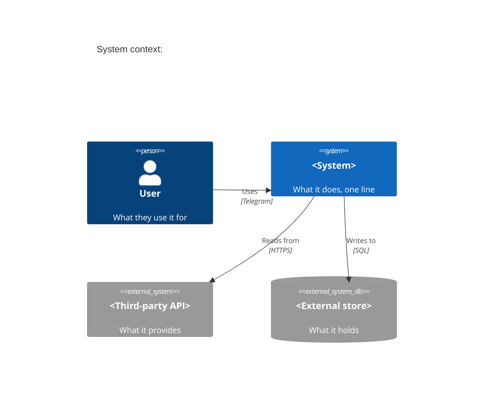
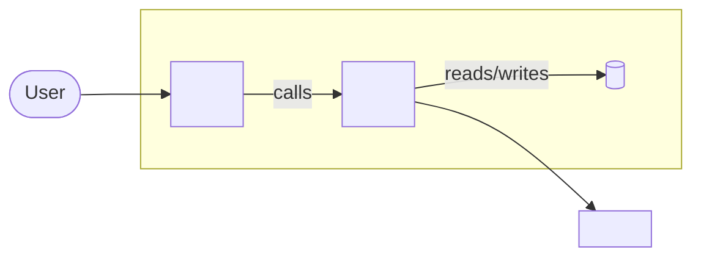
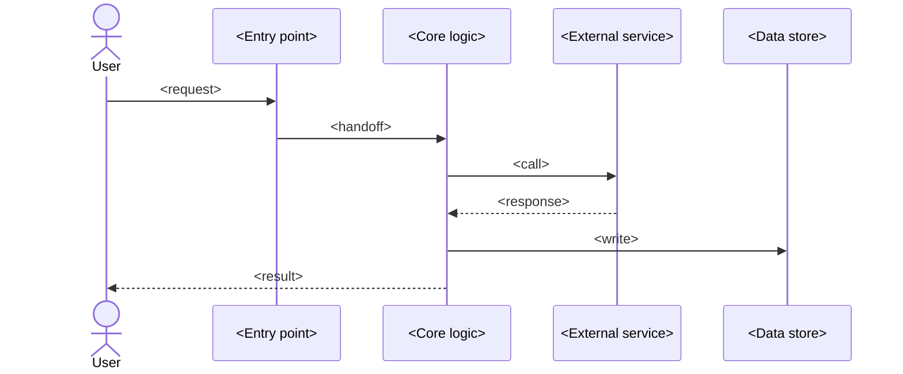
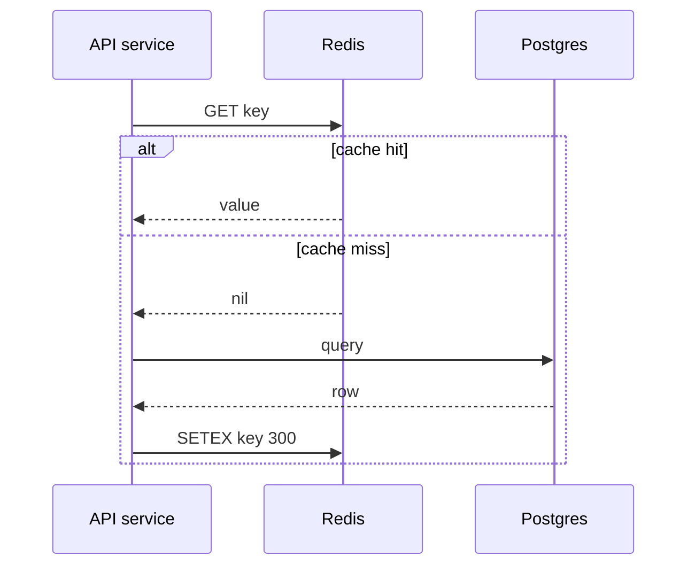
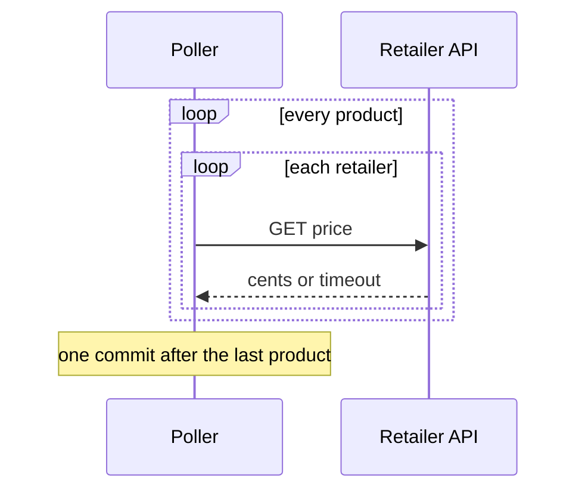
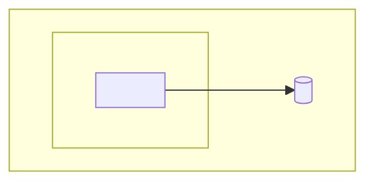

# Mermaid diagrams for architecture.md

One diagram type per job. C4 macros are used for the context diagram only: mermaid still labels its C4 support experimental, and a C4Container diagram needs hand-tuned `UpdateRelStyle` offsets to stay legible, which a frequently edited doc cannot carry. Flowcharts and sequence diagrams are stable, lay themselves out, and survive edits.

| Section | Diagram | Why this one |
|---|---|---|
| System context | `C4Context` | Few elements, so the experimental layout holds, and the macros name people and external systems for you |
| Components | `flowchart LR` with subgraphs | Stable layout, edge labels carry the protocol, easy to edit when a component moves |
| Data flow | `sequenceDiagram` | Ordering and round trips are the point, and only a sequence diagram shows them |
| Deployment | `flowchart TB` with subgraphs | Nesting shows host and runtime without C4Deployment's layout cost |

## System context

`Person(alias, "label", "description")` for a human, `Person_Ext` for one outside your control. `System(...)` for this system, `System_Ext(...)` for a neighbour, `SystemDb_Ext` / `SystemQueue_Ext` when the neighbour is fundamentally a store or a queue. `Rel(from, to, "label", "technology")` for an arrow, `BiRel` for a two-way one. The first argument is always a unique alias; the rest are display text.

## Components

Put this system's own units inside a `subgraph`; leave external things outside it. Label every edge with the protocol or the payload.

Use `[( )]` for a data store, `([ ])` for an actor, `[[ ]]` for a subroutine-like unit, plain `[ ]` for everything else. Keep node labels to a name and its tech; the component table next to the diagram carries the rest.

## Data flow

One diagram per flow, named after the flow. Show the participants that matter and skip the ones that only pass things through.

`->>` is a call, `-->>` is a return. `participant X as <Label>` aliases a long name to a short one: use it so the label matches the component table exactly while the arrows stay readable. `actor` and `participant` mix freely; `actor` just draws a stick figure.

Use `Note over X: ...` for a constraint the arrows cannot show, such as a timeout or a batch size.

Use `alt` / `else` when the two paths are architecturally different, not for every error case. Both branches close with one `end`, and each branch takes a label.

Use `loop <label>` for repetition, which is usually the whole shape of a batch or polling flow. Nested loops render fine; keep them to two levels.

## Deployment

Only when the system runs somewhere more interesting than one local process. Nest runtimes inside hosts.

## Rules

- Draw a diagram only for a section that has something to show. A one-component system does not get a component diagram; write the sentence instead.
- Every edge gets a protocol or payload label unless it is genuinely just "calls".
- Node and element descriptions stay to one clause. The prose and tables beside the diagram carry the detail.
- Names in a diagram match the names in that section's table exactly. A component called `Runner` in the table is `Runner` in the flowchart.
- Diagrams do not carry Built or Planned. The table beside the diagram does, so a diagram showing a planned component is fine as long as its row says so.
- No colours or styling. They add maintenance and say nothing.
