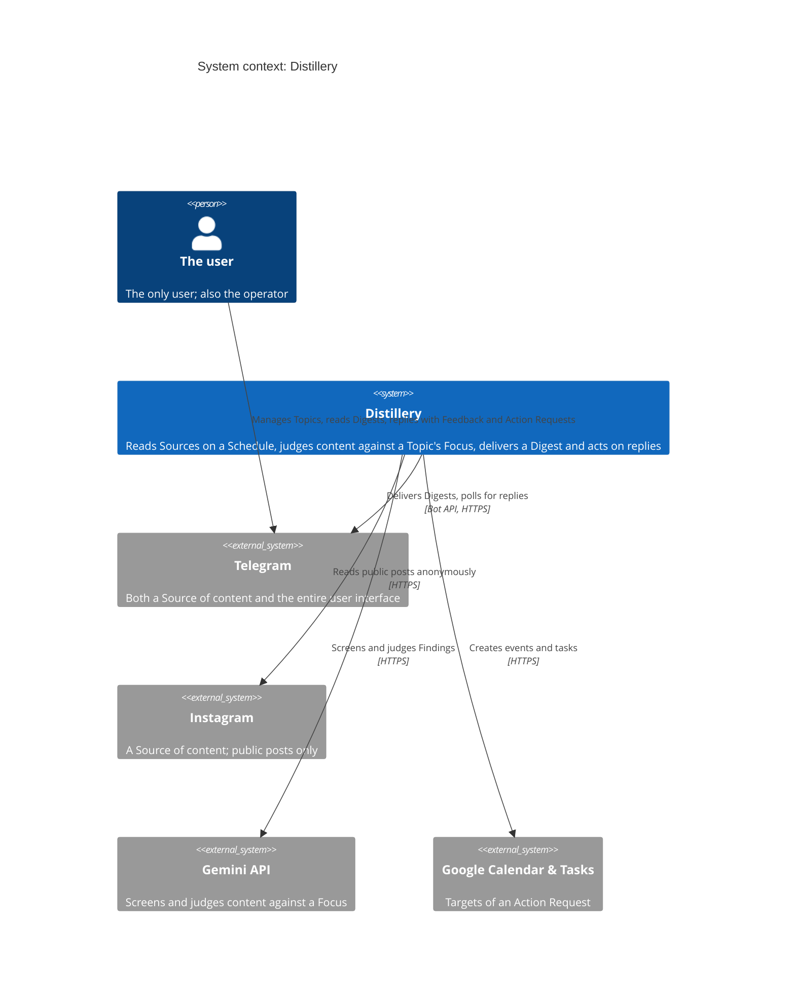
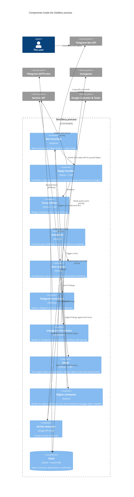

# Architecture vision: Distillery

**Status:** Draft
**Inputs:** Builds on [`../prd/mvp.md`](../prd/mvp.md). Vocabulary is [`../../CONTEXT.md`](../../CONTEXT.md). Decisions are in [`../adr/`](../adr/).

## 1. System context

Distillery is one process that a single user drives entirely through Telegram. It reads from Telegram and Instagram, judges what it reads with an LLM, and writes to Google Calendar and Google Tasks. There is no UI, no HTTP surface, and no second user.

Telegram appears twice on purpose, in two different roles with two different credentials: a personal-account MTProto session reads Sources, and a separate bot identity carries the conversation. [ADR-0001](../adr/0001-personal-telegram-session-for-sources.md) explains why, and [ADR-0005](../adr/0005-two-telegram-libraries-to-isolate-the-user-session.md) explains why they stay apart in code.

## 2. Goals and non-goals

**Goals:**

- Keep access to the Sources alive. The personal Telegram account must not get flagged, and Instagram reads must not get the host throttled into uselessness.
- Adding a Source platform means writing one Connector. The Run engine, the judging stage, and Digest delivery do not change.
- A Run that partly fails still delivers a Digest that names what failed.
- Credential loss that needs a human fails loudly rather than degrading quietly.

**Non-goals, deliberately:**

- Any concurrency or scale beyond one user and a handful of Topics. Growth is a longer Run, never more workers.
- High availability. A missed or failed Run is an annoyance, not an incident. There is no uptime target and no redundancy.
- Portability across hosts or a swappable database. This runs in one place on one stack.
- Real-time or push ingestion. Everything is polled on a Schedule or on demand.
- Multi-user, auth, and permissions, per the PRD. Retrofitting these is a redesign, and that is accepted.

## 3. Components and responsibilities

Distillery is a **single deployable unit**: one Python process, one asyncio event loop, one container. That shape is not a preference, it is forced. Telegram invalidates a user session the instant it sees the same auth key on two connections, and recovery is an interactive SMS login on a headless box, so exactly one process may ever hold the session ([ADR-0004](../adr/0004-one-always-on-process.md)).

Because there is only one container, a C4 Container diagram would just restate the context diagram above, so it is omitted. The structure worth drawing is inside the process, where the Connector seam lives.

| Component | Responsibility | Interfaces |
|---|---|---|
| Bot interface | Every interaction with the user: Topic and Source slash-commands, Digest delivery, reply intake, operational alerts. Holds only a bot token. | Telegram Bot API over HTTPS (long polling) |
| Reply handler | Decides whether a reply is Feedback or an Action Request, and which Blocks it names, from the quoted Digest text. One LLM call. | In-process; Gemini |
| Focus refiner | Merges Feedback into the Topic's Focus and reports the old and new text back. | In-process; Gemini; State |
| Scheduler | Owns time: fires each Topic's Run per its Schedule, and fires any Run missed while the process was down. | In-process |
| Run engine | Orchestrates one Run end to end and decides what a partial failure means. The only component that knows a Run has stages. | In-process |
| Connector (per platform) | Given a Source and a Window, yield that Source's Findings. Owns its platform's pacing, auth, and failure modes. **The extension seam.** | Telethon (MTProto) / instaloader (HTTPS) |
| Judge | Screens Findings with a cheap model, judges survivors with a strong one, assigns Match Level and writes each brief. | Gemini over HTTPS |
| Digest composer | Turns judged Findings into the Digest, splitting it across self-contained messages when it exceeds Telegram's limit, capping Off Topic at 1–2, and naming any Connector that failed. | In-process |
| Action executor | Creates a Google Calendar event or a Google Tasks task. Owns Google's OAuth token lifecycle. | Google Calendar v3, Tasks v1 |
| State | Topics, Sources, their attachments, and the credentials. Nothing about Runs, Findings, or Digests. | SQLite file; Telethon session file |

## 4. Communication and interfaces

Everything inside the process is a direct async call. There is no queue, no bus, and no internal HTTP, because there is no boundary for one to cross. Two contracts are load-bearing anyway.

**The Connector contract** is what makes the seam real. A Connector takes a Source reference and a Window and yields Findings in a shape nothing downstream has to special-case: stable external ID, author, publication timestamp, text, and a permalink back to the original. The Judge and the Digest composer never learn which platform a Finding came from. A Connector also owns its own pacing and raises a typed failure the Run engine can name in a Digest.

**The Digest message is a data contract, not just output.** Since Telegram's chat history *is* the Digest store ([ADR-0003](../adr/0003-telegram-chat-history-is-the-digest-store.md)), a Digest's visible text is the only record that will ever exist of it. Anything a later Action Request might need — the Topic, Block numbers, briefs, and permalinks — has to be in that text, because a reply arrives carrying nothing but the quoted message.

Telegram's 4096-character limit means a Digest with many Blocks is delivered as several messages. Each one repeats the Topic and stands alone, because a reply quotes exactly one message and that message is all the reply handler will see. Block numbering runs continuously across the whole Digest, so a Block number is unambiguous even though no single message holds them all.

## 5. Tech stack and rationale

| Component | Stack | Why |
|---|---|---|
| Language, tooling | Python 3.12, uv workspace, ruff, ty | Matches the monorepo; both Telegram and Instagram libraries are Python-first. |
| Telegram Sources | Telethon 1.x | The only healthy MTProto library. Pyrogram was archived in 2023, and its look-alikes on PyPI have been a live supply-chain target. Telethon also exposes first-party pacing on history reads. |
| Telegram bot | aiogram 3.x | `start_polling` is a plain coroutine, so it shares the event loop cleanly where python-telegram-bot's `run_polling` blocks it. Deeper reason in [ADR-0005](../adr/0005-two-telegram-libraries-to-isolate-the-user-session.md). |
| Instagram Sources | instaloader, anonymous | No account to ban, per [ADR-0006](../adr/0006-read-instagram-anonymously.md). |
| Judging | Gemini API, two models | Cheapest per token at the screening end, and Google is already a dependency for Calendar and Tasks. |
| State | SQLite | The data is a few dozen rows. Backup is copying a directory. |
| Scheduling | In-process asyncio | External cron would mean a second process touching the Telegram session, which [ADR-0004](../adr/0004-one-always-on-process.md) forbids. |
| Actions | `google-api-python-client` + `google-auth-oauthlib` | The documented path. Scope is `calendar.app.created`, so Distillery creates and owns a Distillery calendar and cannot reach the primary one. |

## 6. Hosting, deployment, and infra

One Hetzner CX23 in Germany or Finland, about €6/month for 2 vCPU and 4 GB. Two reasons beyond price. Cloud IPv4 is billed separately almost everywhere now and on AWS the address costs more than a comparable instance, which inverts the usual assumption that a hyperscaler is the cheap default. And the egress region should sit near the phone number behind the Telegram session: accounts moved to a distant datacenter are reported to get signed out. That report is anecdotal, but the mitigation is free.

Deployment is Docker with `restart: unless-stopped`. Two things must be right or the Telegram session dies:

- The state directory is a **named** volume. An anonymous volume silently orphans the session file on the next `docker run`, which means a fresh SMS login.
- The process handles `SIGTERM` and disconnects Telethon before exiting. `docker stop` allows ten seconds, and a new container claiming the session while the old one still holds it is exactly the duplicate-connection case that invalidates it.

Secrets live in a root-owned `0600` env file on the host, injected as environment variables. No vault, no KMS: an explicit non-goal.

Two operational obligations that are easy to miss and both bite silently. The Google OAuth app must be set to **In production**, not Testing, or its refresh token expires every seven days. And an unused refresh token dies after six months, which a rarely-triggered Action Request could plausibly reach.

No deployment diagram: one container on one VM, which the prose above covers without a picture.

## 7. Functional requirements at the system level

- Maintain Topics (Focus, Window, Schedule) and their Source attachments, edited entirely through bot commands.
- Fire a Run on Schedule or on demand, and fire once on startup any Run that came due while the process was down.
- For each Run, read every attached Source across the Window, judge every Finding against the Focus, and assign a Match Level.
- Deliver one Digest per Run — numbered Blocks, briefs, permalinks, at most 1–2 Off Topic, and a named note for any Source that failed — as a single message where it fits, or as several self-contained messages where it doesn't.
- Interpret any reply to a Digest as Feedback or an Action Request and execute it immediately, with no confirmation step.
- Report the old and the new Focus whenever Feedback changes it.
- Resolve every Schedule firing, Window boundary, and relative time in an Action Request ("next Thursday at 10am") against one configured timezone, while storing and computing in UTC.
- Fail loudly, via the bot where possible, when a credential needs human hands.

## 8. Non-functional requirements

| Quality | Scenario (stimulus → response → measure) | Assumption? |
|---|---|---|
| Source access continuity (Telegram) | A Run reads 14 days of history from 10 channels → Telethon paces history requests with an explicit `wait_time` and auto-sleeps below its FloodWait threshold → no account limit reported by Telegram's own `@SpamBot` over a month of Runs. | No. Note that `wait_time` defaults to no delay, so this must be set deliberately. |
| Source access continuity (Instagram) | A Run reads 6 Instagram Sources anonymously from a datacenter IP → reads are strictly serial with a randomized delay and a hard per-Run request cap; a `429` ends that Connector's contribution rather than retrying into a block → no sustained throttling across a week of Runs. | Yes. The delay and cap are guesses; tune them against real behaviour. |
| Partial-failure resilience | A Connector breaks mid-Run, or a judging call errors → the Run completes with what succeeded and the Digest names the failure → verified by deliberately breaking the Instagram Connector. | No. |
| Loud credential failure | The Telegram session is revoked, or the Google refresh token expires → Distillery alerts on Telegram where it still can, then exits non-zero rather than restart-looping. A revoked Telegram session cannot alert through Telegram, so it exits loudly to the log. | No. |
| Session durability | The host reboots or a new image is deployed → the process restarts and reuses the existing Telegram session with no re-authentication. | No. |
| Judging cost | One Run over a few hundred Findings → a cheap model screens, a strong model judges only the survivors → cost per Run stays low enough not to think about. | Yes. No ceiling measured yet; revisit after real Runs. |
| Volume | Up to ~10 Sources per Topic and low hundreds of Findings per Run. | Yes, explicitly. Stated so that blowing past it is a visible event. |
| Latency | An on-demand Run is triggered → the bot acknowledges within a couple of seconds and the Digest arrives when it arrives. A Run taking minutes is fine. | No. |

## 9. Success criteria for the architecture

- **The seam holds.** Adding a third Source platform means writing one Connector and registering it, with no edits to the Run engine, the Judge, or Digest delivery. This is the one thing the design deliberately paid for.
- **It survives being left alone.** A week runs unattended with no intervention, and the Telegram user session survives every deploy and reboot without re-authentication.

## 10. Risks and unknowns

- **The Instagram Connector will break, and not on your schedule.** instaloader depends on Meta's internal GraphQL query IDs, which rotate; fixes land when a volunteer ships them. This is why partial-Digest delivery is a goal rather than a nicety.
- **A reply can quote the wrong half of a split Digest.** Naming Block 12 while replying to the message that only holds Blocks 1–8 leaves the reply handler unable to resolve it, since the quoted message is all it sees. The handler has to detect that and say so rather than guess.
- **Two-stage judging can lose a real match, and nothing will tell you.** The cheap screening model sees each Finding before the strong one does, so a Full Match it discards is invisible and unmeasurable. The risk was introduced by a cost optimisation, for a cost that is not a stated goal, and it aims straight at the PRD's kill condition of not trusting Digests. Accepted unmeasured for v1; the cheap check is re-running one Topic with screening off and comparing.
- **Deploys are the moment the session is most at risk.** Duplicate connections invalidate it, so overlapping containers, a fast restart, or running the app locally against the production session file all cost an SMS login.
- **Telethon is a single-maintainer project** that moved off GitHub to Codeberg, with a 2.x branch that has never been released. Not fragile today, but it is the load-bearing dependency with the fewest alternatives.
- **Anonymous Instagram access from a datacenter IP** is reportedly throttled harder than authenticated access. If that proves fatal, the fallbacks all cost money or an account.
- **The bot forgets after a day.** Telegram discards undelivered updates after 24 hours, so downtime beyond a day loses replies with no trace.
- Product risk around LLM judgment quality is the PRD's to own, not repeated here.

## 11. Alternatives considered and rejected

Each of these is recorded where the reasoning belongs; only the headline is here.

| Decision | Rejected alternative | Recorded in |
|---|---|---|
| Telegram history is the Digest store | A real Digest and Block schema in SQLite | [ADR-0003](../adr/0003-telegram-chat-history-is-the-digest-store.md) |
| One always-on process | Lambda plus a scheduler; a separate Run worker; managed containers | [ADR-0004](../adr/0004-one-always-on-process.md) |
| Telethon plus aiogram | One Telethon client for both roles; python-telegram-bot | [ADR-0005](../adr/0005-two-telegram-libraries-to-isolate-the-user-session.md) |
| Anonymous Instagram reads | Official `business_discovery`; authenticated scraping with a proxy; dropping Instagram | [ADR-0006](../adr/0006-read-instagram-anonymously.md) |
| Hetzner | AWS Lightsail at a similar price but 512 MB; EC2, where the IPv4 costs more than the instance; Oracle's free tier, which reclaims instances idle under 20% — precisely this workload | This document, §6 |
| Gemini | OpenAI or Anthropic at the same shape; OpenRouter as a swappable gateway | Not ADR-worthy: swapping providers is a contained change |

## 12. Architecture decisions

- [`../adr/0001-personal-telegram-session-for-sources.md`](../adr/0001-personal-telegram-session-for-sources.md): read Sources through a personal-account session, keeping a separate bot identity for the conversation.
- [`../adr/0002-instagram-scraping-accepted-risk.md`](../adr/0002-instagram-scraping-accepted-risk.md): **superseded by 0006.** Instagram is in v1 via scraping; the account-ban risk it accepted no longer applies.
- [`../adr/0003-telegram-chat-history-is-the-digest-store.md`](../adr/0003-telegram-chat-history-is-the-digest-store.md): nothing about Runs, Findings, or Digests is persisted; replies resolve from the quoted Digest.
- [`../adr/0004-one-always-on-process.md`](../adr/0004-one-always-on-process.md): one always-on process, because only one may hold the Telegram session.
- [`../adr/0005-two-telegram-libraries-to-isolate-the-user-session.md`](../adr/0005-two-telegram-libraries-to-isolate-the-user-session.md): two Telegram libraries, so bot code cannot touch the user auth key.
- [`../adr/0006-read-instagram-anonymously.md`](../adr/0006-read-instagram-anonymously.md): read Instagram anonymously, with no Instagram account at risk.
