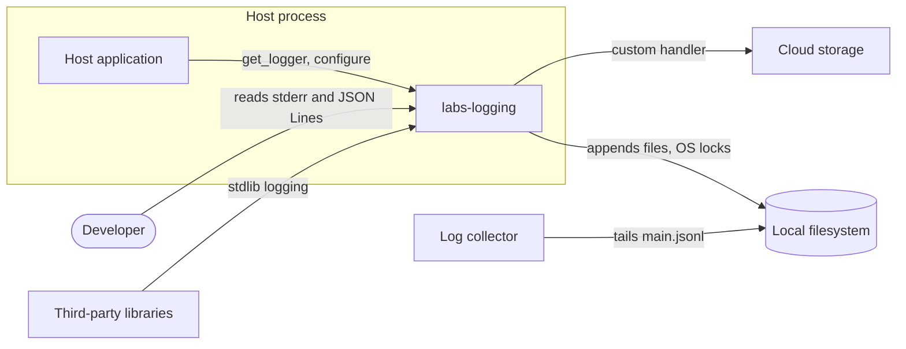
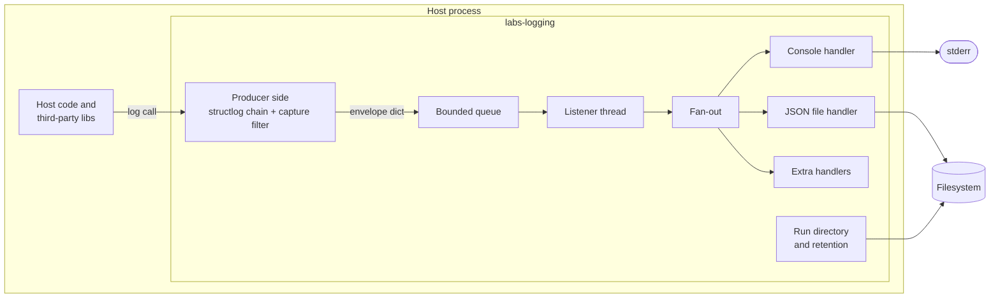
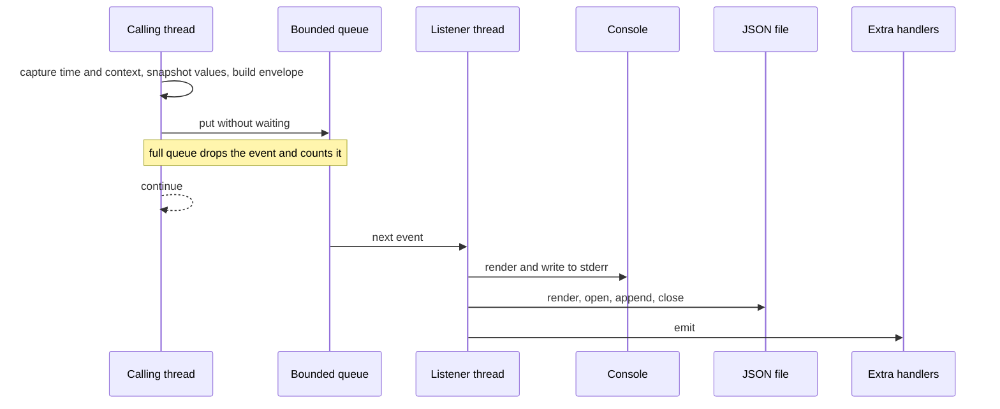
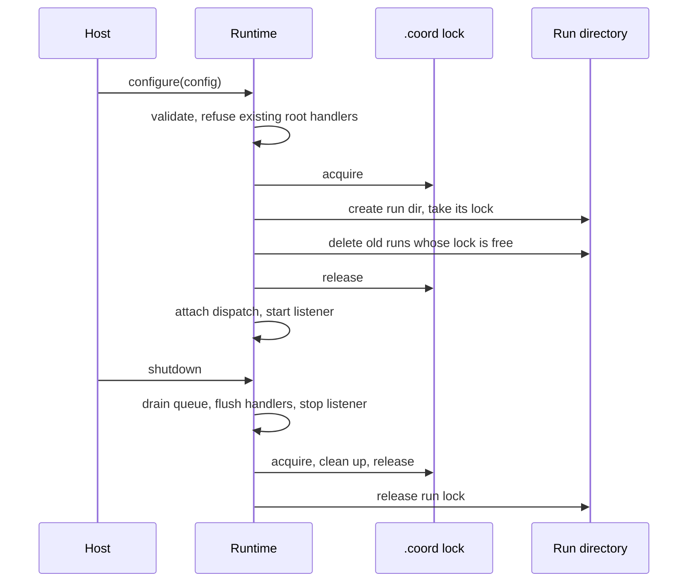

# Architecture: labs-logging

**What it is:** A Python library, embedded in each host application's process, that turns stdlib and structlog log calls into one JSON envelope and writes it to the console and to size-bounded files, one directory per process start.

**Built** means the code does this today. **Planned** means it is the intended shape and does not exist yet. Where a Planned line was assumed rather than decided, its row says so.

## Constraints that shape this

`packages/labs-logging/docs/vision.md` does not exist. These come from the design session and the spec.

- **Application-neutral:** any application in the monorepo can use it. It names no application, and a dummy app is the only consumer inside the package.
- **Local first, extensible later:** it writes to the local machine now. Azure Blob and S3 destinations are expected and must plug in without editing the package.
- **Stdout is not ours:** MCP stdio servers carry protocol traffic on stdout, so the console writes to stderr only.
- **Independent processes:** several processes of the same application may run at once and must not share or overwrite a file.
- **Expected size:** not stated.

## System context

- **Host application:** configures once, then every module calls `get_logger`.
- **Third-party libraries:** their stdlib records are captured through the root logger.
- **Log collector:** reads either the file or the JSON console stream. It is the consumer's choice and nothing here calls it.
- **Cloud storage:** reached only through a handler the host supplies as `extra_handlers`. Nothing in the package talks to it.

## Components

The package is a library, so nothing here deploys on its own. The units below are the in-process stages a log event passes through.

| Component | Owns | Tech | Status |
|---|---|---|---|
| Config (`config.py`) | The validated settings for one runtime. Frozen. Path-safe `app` and `family` | Pydantic v2 | Built |
| Producer side (`envelope.py`, `normalize.py`, capture filter in `runtime.py`) | Turning a structlog event or a stdlib record into one envelope, snapshotting values, capturing timestamp and context on the calling thread | structlog, stdlib `logging` | Built |
| Context (`context.py`) | Bound fields that follow a thread or an asyncio task | structlog contextvars | Built |
| Dispatch (`runtime.py`) | Queue plus listener thread, or direct calls in synchronous mode. Drop accounting | stdlib `queue`, `threading` | Built |
| Fan-out (`runtime.py`) | Calling each handler in turn and isolating one handler's failure from the others | stdlib `logging.Handler` | Built |
| Console handler | Rendering to a stream, pretty or JSON | structlog `ConsoleRenderer`, `JSONRenderer` | Built |
| JSON file handler (`rotation.py`) | Appending one line per event and rolling over at a size | stdlib file I/O | Built |
| Run directory and retention (`dirs.py`, cleanup in `runtime.py`) | A unique directory per start, and deleting whole old runs | filesystem | Built |
| File lock (`lock.py`) | The OS lock that marks a run active and serializes cleanup | `fcntl.flock`, `msvcrt` | Built (Windows untested) |
| Runtime (`runtime.py`) | Setup, rollback, shutdown, and health. One active runtime per process | stdlib | Built |
| Cloud handler (Azure Blob, S3) | Shipping events off the machine | host-supplied `logging.Handler` | Planned |

Ownership of "one active runtime per process" holds by a module-level flag, and nothing stops a host from attaching its own root handler first. Setup detects that and refuses.

Coupling the edges do not show: all handlers share the one listener thread, so a slow handler delays the ones after it. The package depends on `structlog>=24,<25` because the formatter wiring relies on `ProcessorFormatter` internals.

## Data flow

### Log call to destinations, background mode — Built

A handler that raises is caught and recorded, and the next handler still runs. In synchronous mode there is no queue and the same three writes run on the calling thread under the handler lock.

### Startup and shutdown — Built

Any failure after the first side effect rolls everything back and raises `SetupError`.

## Interfaces and contracts

| Interface | Kind | Shape | Consumer | Status |
|---|---|---|---|---|
| `configure(LoggingConfig) -> Runtime` | Python API | Runs once per process, usable as a context manager | Host entrypoint | Built |
| `get_logger(name)` | Python API | Lazy structlog logger, valid before `configure` | Every host module | Built |
| `bind_context`, `bound_context`, `unbind_context` | Python API | Keyword fields scoped to a thread or task | Host code | Built |
| `Runtime.healthy`, `errors`, `error_count`, `drops` | Python API | Failure and drop counters | Host health checks | Built |
| Log envelope | JSON Lines | `timestamp`, `level`, `logger`, `application`, `run_id`, `process_id`, `event`, `context`, and `exception` when present. Keys sorted. Caller fields live under `context` | Collectors, humans | Built |
| `extra_handlers` | Extension seam | Any `logging.Handler`. `record.msg` is the envelope dict | Cloud handlers | Built |
| Log files | Filesystem | `<log_dir>/<UTC start>-<suffix>/main.jsonl`, backups `main.jsonl.N`, and `lock` | Collectors, humans | Built |

## Data stores

| Store | Holds | Source of truth for | Retention | Status |
|---|---|---|---|---|
| Run directories under the log dir | The envelope lines of one process start, its backups, and its lock file | What that process logged, until deleted | Newest `retain_runs` runs, plus any run still active. Backups per run are bounded by `backups` and `max_bytes` | Built |

## External dependencies

| Dependency | Used for | When it is down | Status |
|---|---|---|---|
| Local filesystem | Run directories and locks | A write error marks the runtime unhealthy and the console keeps working. A setup error fails startup with `SetupError` | Built |
| structlog, platformdirs, pydantic | Rendering, default log directory, config | Not applicable. They load at import | Built |
| Azure Blob or S3 | Off-machine copy of events | Not applicable yet. The host's handler decides, and its failure is isolated in the fan-out | Planned |

## Deployment and runtime

It runs inside the host process. It starts when the host calls `configure`. Importing the package or calling `get_logger` opens no files and starts no threads. It needs a writable log directory, which defaults to the platform user log directory for `app`. It adds one daemon listener thread in background mode.

## Cross-cutting concerns

| Concern | How it works here | Status |
|---|---|---|
| Authentication and authorization | None. Any process that can write the log directory writes logs, and nothing restricts who reads them | Built |
| Configuration and secrets | One frozen `LoggingConfig`. Nothing reads environment variables. Nothing redacts values, so a secret passed as a field is written | Built |
| Logging and observability | This is the logging system. Its own failures go to stderr and to `Runtime.errors` | Built |
| Error handling and retries | Setup is strict and transactional. Runtime handler failures are isolated and counted. Nothing retries a write | Built |

## Scale and reliability

- **Throughput:** one listener thread writes every event in order, each as its own open, append, close. Calling threads never wait on I/O. The queue capacity is `queue_size`, and a full queue drops the new event.
- **Failure behaviour:**
  - A process that ends without `shutdown()` loses events still in the queue. The listener is a daemon and nothing registers an `atexit` hook.
  - A hung handler stops the listener. Shutdown waits a bounded time for it and records the timeout.
  - A killed process holds no lock, so its run becomes deletable at the next setup.
- **Recovery:** automatic for locks and retention. Nothing replays dropped or lost events.

## Open questions and assumptions

**Open**

- **Should `configure` register `atexit` shutdown by default and work without `with`?** Changes the Runtime lifecycle and removes the lost-queue case.
- **Should third-party loggers get their own level (`third_party_level`)?** Changes the root-logger level wiring.
- **Should the console hide `application`, `run_id`, `process_id`, and empty `context`?** Changes the console renderer chain only.

**Assumed**

- **Rotated backups default to 3.** The user set it. The design spec still says zero. Settled by the user updating the spec or leaving it.
- **A directory with a `lock` file and a run-style name is a run.** Cleanup deletes such directories under the log dir. Settled by a host that puts its own directories there.
- **Windows works.** The `msvcrt` path is written, and nothing tests it. Settled by running the suite on Windows.

## Limits and non-goals

- **One writer per file, one file per run:** processes never share a log file, so there is no combined timeline across processes. See `docs/adr/0001-isolate-log-files-by-run.md`.
- **Storage is not a hard cap:** active older runs, backups and oversized events can exceed `retain_runs × (backups + 1) × max_bytes`.
- **Delivery is best effort in background mode:** a full queue drops, and a missing `shutdown()` loses the queue.
- **One runtime per process:** a second `configure` raises `AlreadyConfiguredError`, and a forked child must configure afresh.
- **Not a log shipper or aggregator:** the package writes files and streams. Reading, shipping and searching belong to a collector or a custom handler.
