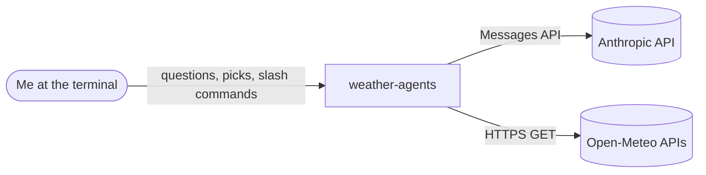
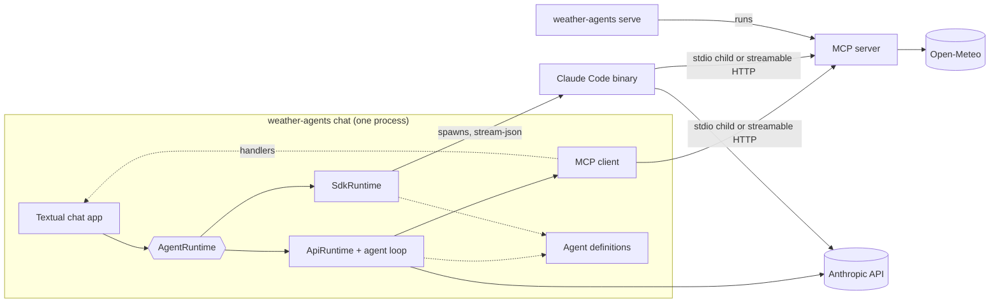
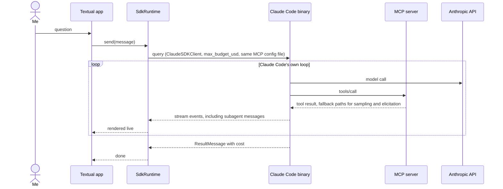

# Architecture: weather-agents

**What it is:** A local Python CLI that holds a weather conversation in a Textual chat, driven by one of two interchangeable agent runtimes, both talking over MCP (stdio or streamable HTTP) to an Open-Meteo MCP server from the same package.

**Built** means the code does this today. **Planned** means it is the intended shape and does not exist yet. Where a Planned line was assumed rather than decided, its row says so.

## Constraints that shape this

- **Time and effort budget:** evenings and weekends, no deadline. Each piece has to be useful on its own before the next one starts.
- **Learning goals:** the MCP protocol from both sides, both transports, sampling, elicitation, progress and log notifications, an agent loop written by hand, and the Claude Agent SDK. Where shipping fast and learning disagree, learning wins, so the API runtime gets its own loop and its own MCP client instead of a framework's.
- **Expected size:** one user, one chat session at a time, on one machine.
- **Hard limits:**
  - Runs locally only. Nothing is deployed, and nothing listens beyond `127.0.0.1`.
  - Secrets come from `.env` and nowhere else.
  - API spend is capped at roughly $10 to $20 a month, so every user message carries a USD cap.
  - Python 3.12 in the `labs` uv workspace.
  - Open-Meteo's free tier: no key, CC-BY attribution, non-commercial use, rate limits.
  - Anthropic models only. No provider abstraction, no agent frameworks.
- **Protocol facts the shape depends on (provisional, looked up 2026-10-01 for `mcp` 2.2.0 and `claude-agent-sdk`):**
  - The official `mcp` SDK's client defaults to the 2026-07-28 protocol, where a server cannot send requests to a client. Server-pushed sampling and elicitation only work on a stateful session negotiated with `Client(..., mode="legacy")`. Source: [py.sdk.modelcontextprotocol.io/v2/protocol-versions](https://py.sdk.modelcontextprotocol.io/v2/protocol-versions).
  - The Agent SDK runs a Claude Code binary bundled in the pip package. Its MCP client has no documented sampling support, and its elicitation hook exists only in TypeScript. Source: [code.claude.com/docs/en/agent-sdk/hooks](https://code.claude.com/docs/en/agent-sdk/hooks), [code.claude.com/docs/en/mcp](https://code.claude.com/docs/en/mcp).
  - The Claude API's MCP connector needs a public `https` URL, so it cannot reach a local server. Source: [platform.claude.com/docs/en/agents-and-tools/mcp-connector](https://platform.claude.com/docs/en/agents-and-tools/mcp-connector).

## System context



- **Me:** start a chat with a chosen runtime and MCP config, ask questions, answer elicitation prompts, clear the conversation, start the HTTP server.
- **Anthropic API:** every model call, from the API runtime's loop, from its sampling handler, and from the Claude Code binary under the SDK runtime.
- **Open-Meteo:** all weather data, from the endpoints listed in [`open-meteo-mcp-scope.md`](open-meteo-mcp-scope.md).

## Components



| Component | Owns | Tech | Status |
|---|---|---|---|
| CLI process (`weather-agents chat`) | The chat session: runtime choice, MCP config choice, the on-screen transcript, the conversation's lifetime | Click, Textual, pydantic-settings | Planned |
| MCP server | Open-Meteo's tools, resources, and prompts over MCP, and the only code that calls Open-Meteo | Official `mcp` SDK (`MCPServer`) ([ADR-0003](adr/0003-official-mcp-sdk-over-fastmcp.md)), httpx | Built for level 1 over stdio: eleven tools, a guide and an endpoint-page resource with completion, and two prompts. Planned: the dossier, sampling, elicitation, progress and log notifications |
| HTTP server process (`weather-agents serve`) | Running the MCP server on streamable HTTP at `127.0.0.1`, stateful or stateless by flag | Same package, `mcp.run(transport="streamable-http")` | Planned |
| Claude Code binary | The Agent SDK's agent loop, its MCP client, and its subagent dispatch | Bundled in `claude-agent-sdk`, spawned per chat session | Planned |

Under stdio there is no `serve` process: whichever MCP client is in use spawns the server as a child process from the stdio config. Under the API runtime that client is ours. Under the SDK runtime it is the Claude Code binary's.

Inside the CLI process, these modules hold the boundaries. They are enforced by convention, with no import checks:

| Module | Owns | Status |
|---|---|---|
| `cli` | Click commands, Textual app, rendering of streamed text, tool calls, progress, and logs; the elicitation modal | Planned |
| `runtimes` | The `AgentRuntime` interface (send a message and stream events back, clear, close) and its two implementations. The CLI depends only on the interface | Planned |
| `agent_loop` | The API runtime's loop: call the model, run tool calls, append results, repeat. Stops on `end_turn`, on the per-message USD cap, on the per-message deadline, or on an error. Depends on a tool-provider interface, not on MCP | Planned |
| `mcp_client` | A weather-agnostic MCP client: opens one session per configured server from an `mcpServers` file, keeps it open for the chat, lists and calls tools, reads resources, gets prompts. Its sampling, elicitation, progress, and log handlers are injected by its caller | Built for level 1 over stdio: one session per server, calls routed by server name, a server that fails to open recorded while the others still open, and every error naming its server. Planned: the sampling, elicitation, progress, and log handlers, and HTTP entries |
| `agents` | Orchestrator and specialist definitions: system prompts, tool allowlists, model. Read by both runtimes, so neither owns a prompt ([ADR-0001](adr/0001-two-agent-runtimes-over-one-tool-layer.md)) | Planned |
| `server` | The MCP server. Split inside into an `openmeteo` layer that knows HTTP and response shapes and nothing about MCP, and the MCP tools, resources, and prompts built on it. Never imported by the CLI side | Built |
| `settings` | One pydantic-settings object: defaults in code, overridden by `.env` and the environment, then by Click flags for one run | Planned |

Coupling the diagram does not show: the CLI and the server ship as one uv package, `weather-agents`, and share a release. Both runtimes and the sampling handler use the one `ANTHROPIC_API_KEY`.

## Data flow

### A question under the API runtime: Planned

```mermaid
sequenceDiagram
    actor Me
    participant UI as Textual app
    participant RT as ApiRuntime
    participant Loop as Agent loop
    participant MC as MCP client
    participant S as MCP server
    participant A as Anthropic API
    participant OM as Open-Meteo
    Me->>UI: question
    UI->>RT: send(message)
    RT->>Loop: run(history + message, USD cap, deadline)
    loop until end_turn, USD cap, deadline, or error
        Loop->>A: messages.create (stream)
        A-->>UI: text deltas
        A-->>Loop: tool_use blocks
        Loop->>MC: call_tool(name, args)
        MC->>S: tools/call
        S->>OM: GET
        OM-->>S: JSON
        S-->>MC: progress and log notifications
        MC-->>UI: rendered live
        opt tool needs sampling (dossier)
            S->>MC: sampling/createMessage
            MC->>A: messages.create, same model, same USD cap
            A-->>MC: completion
            MC-->>S: result
        end
        opt place name is ambiguous
            S->>MC: elicitation/create
            MC->>UI: modal with the candidates
            Me->>UI: pick one
            UI-->>MC: choice
            MC-->>S: result
        end
        S-->>MC: tool result
        MC-->>Loop: tool_result
    end
    Loop-->>RT: final answer, cost
    RT-->>UI: done
```

The client opens its sessions with `mode="legacy"`, so the server can push the sampling and elicitation requests. When the orchestrator delegates, the specialist runs as a nested loop behind a tool. It spends the parent's USD cap and deadline, not its own.

### A question under the SDK runtime: Planned



The SDK runtime enforces the deadline itself, with an `asyncio` timeout that calls `interrupt()`, because the SDK has no wall-clock option. Specialists are SDK subagents built from the same `agents` definitions, restricted to their MCP tools by `tools` allowlists.

## Interfaces and contracts

| Interface | Kind | Shape | Consumer | Status |
|---|---|---|---|---|
| `weather-agents chat` | CLI command | `--runtime api\|sdk`, `--mcp-config <file>`, overrides for model, USD cap, deadline. In-chat commands include clearing the conversation | Me | Planned |
| `weather-agents serve` | CLI command | `--port`, `--stateless` | Me | Planned |
| `mcp.stdio.json`, `mcp.http.json` | Config files | Claude Code's `mcpServers` format. The stdio file has `command` and `args`. The HTTP file has `type: "http"`, `url`, and `headers` with a `${WEATHER_MCP_TOKEN}` placeholder. Both runtimes read the same file unchanged | `mcp_client`, Claude Code binary | Built for `mcp.stdio.json`, which has one `open-meteo` entry that `mcp_client` reads. Planned: `mcp.http.json`, and the Claude Code binary reading either file |
| MCP server surface | MCP | Tools, resources with a template and completion, and prompts, as listed in [`open-meteo-mcp-scope.md`](open-meteo-mcp-scope.md). Tools return structured content | Any MCP client | Built for level 1. Planned for level 2 |
| `.env` | Environment | `ANTHROPIC_API_KEY`, `WEATHER_MCP_TOKEN`, and any setting overrides | `settings`, the `${...}` expansion in config files | Planned |

## Data stores

| Store | Holds | Source of truth for | Retention | Status |
|---|---|---|---|---|
| API runtime's message list | The conversation sent to the model | The API runtime's conversation | Process lifetime. Cleared on the clear command | Planned |
| Claude Code session | The conversation inside the binary | The SDK runtime's conversation | Lives as long as the `ClaudeSDKClient`. Clearing opens a new client | Planned |
| Textual transcript | What is on screen | Nothing. A view, rebuilt from runtime events | Process lifetime | Planned |
| `.logs/mcp-server.log` | The server's own Python logging | Server diagnostics | Until deleted | Planned |

The model's history and the on-screen transcript are separate. The runtime owns what the model sees, and the UI owns what I see.

## External dependencies

| Dependency | Used for | When it is down | Status |
|---|---|---|---|
| Anthropic API | All model calls | The message fails, the error shows in the chat, and the conversation stays usable for the next message | Planned |
| Open-Meteo APIs | All weather data | The tool returns an error result the model can read. In the dossier, the other sources still return and a log notification names the missing one | Planned |

## Deployment and runtime

Nothing is deployed. Everything runs on my machine from the uv workspace.

- **The server alone (Built):** `python -m weather_agents.server` runs it over stdio. `make inspect` in `packages/weather-agents` opens it in MCP Inspector and needs `npx`. `make test` runs the offline tests. `make test-live` calls the real Open-Meteo.
- **stdio (Planned):** `uv run weather-agents chat --runtime api|sdk --mcp-config mcp.stdio.json`. One terminal. The MCP client in use spawns the server as its child.
- **HTTP (Planned):** `uv run weather-agents serve [--stateless]` in one terminal, then `chat --mcp-config mcp.http.json` in another.
- **Needs:** `.env` with `ANTHROPIC_API_KEY`, and `WEATHER_MCP_TOKEN` once HTTP auth exists. Network access to Anthropic and Open-Meteo. No Node; the SDK bundles its binary.

## Cross-cutting concerns

| Concern | How it works here | Status |
|---|---|---|
| Authentication and authorization | A static bearer token on the HTTP transport. The server rejects requests without it, and both clients send it from the expanded `headers`. stdio has none: whoever can spawn the process owns it | Planned |
| Configuration and secrets | pydantic-settings reads defaults, then `.env` and the environment, then Click flags. MCP connection details live only in the two config files. Secrets live only in `.env` | Planned |
| Logging and observability | MCP log and progress notifications render live in the chat (API runtime). The server's Python logging goes to `.logs/mcp-server.log`, never to stderr, because a stdio child's stderr would draw over the Textual screen. Each message shows its cost when it finishes | Planned |
| Error handling and retries | No retries anywhere. Open-Meteo errors become tool error results, and each Open-Meteo call has a 30 second timeout. The loop turns a hit cap or deadline into a visible stop reason, not an exception | Built for the server. Planned for the loop |
| Graceful degradation | When a session has no back channel (stateless HTTP, the 2026 protocol, or the Claude Code client), the server catches the failed sampling or elicitation request and takes the fallback path from the scope doc instead of erroring | Planned |

## Scale and reliability

- **Throughput:** one user. The loop runs tool calls from one model turn in order unless parallel execution is added. One question is bounded by its USD cap and its deadline, both settings.
- **Failure behaviour:** if a stdio server child dies, the MCP session fails, the current tool call surfaces as an error, and the rest of the chat has no tools until restart. If the `serve` process dies, HTTP calls fail the same way. If the CLI crashes or exits, the conversation is lost by design.
- **Recovery:** manual. Restart the CLI, or restart `serve` and then the CLI.

## Open questions and assumptions

**Open**

- **Which specialists exist and where their boundaries fall:** changes the `agents` definitions and every tool allowlist. [ADR-0002](adr/0002-open-meteo-as-the-single-data-domain.md) suggests they follow Open-Meteo's endpoint families.
- **Whether the Claude Code binary negotiates the legacy or the 2026 protocol, and what it does with an elicitation request when no Python hook exists:** changes whether the SDK runtime ever sees the elicitation path or always gets the candidate list.

**Assumed**

- **The MCP client pins `mode="legacy"`:** forced by push-style sampling on the official SDK ([ADR-0003](adr/0003-official-mcp-sdk-over-fastmcp.md)). Settled once the dossier samples successfully over stdio and stateful HTTP.
- **The SDK runtime's deadline uses an `asyncio` timeout plus `interrupt()`:** settled by checking that an interrupted run leaves the client usable for the next message.
- **The Claude Code binary keeps its session files under `~/.claude/projects` by default:** if so, the SDK runtime writes conversations to disk, which the vision's in-memory rule did not expect. Settled by checking after one SDK session, and by turning it off if an option exists.

## Limits and non-goals

- **The SDK runtime never samples and never gets a Python elicitation callback:** the dossier returns structured sections without a report, and ambiguous places come back as candidates for the agent to ask about. The two runtimes visibly differ here, and that difference is accepted (see [ADR-0001](adr/0001-two-agent-runtimes-over-one-tool-layer.md)).
- **Stateless HTTP has no back channel:** in that mode sampling and elicitation always take the fallback paths, on both runtimes.
- **The runtime is fixed for the life of a chat:** switching means restarting the CLI.
- **No conversation outlives the process.**
- **Not the Claude API's MCP connector:** it needs a public URL, and nothing here is exposed.
- **Not a provider abstraction:** `AgentRuntime` hides how the loop runs, not which model vendor runs it.
